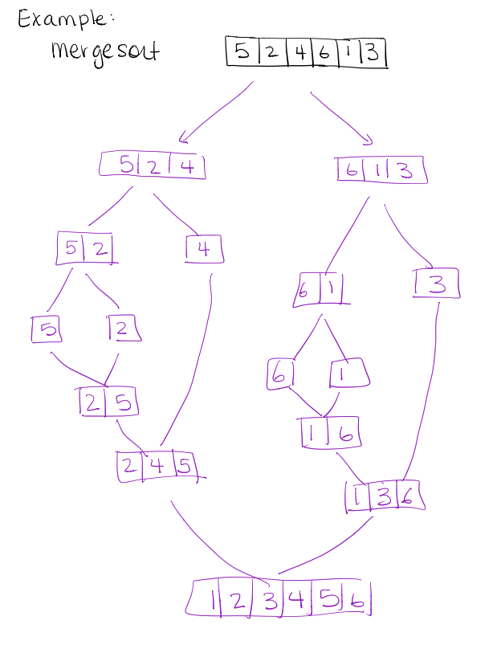
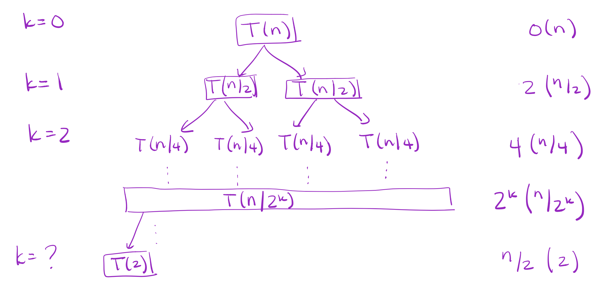
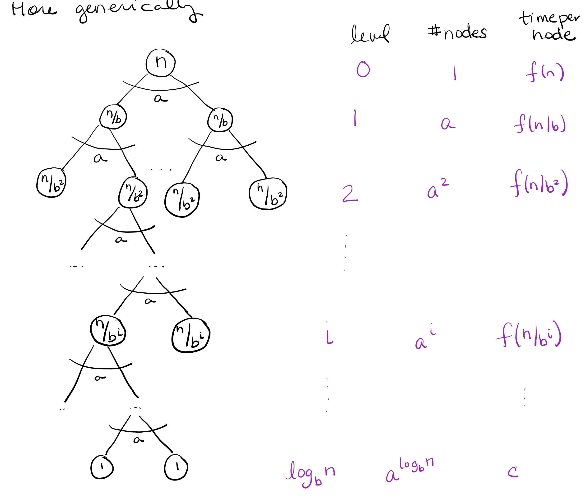

# Divide and Conquer (Dynamic Programming)
Divide and conquer design
- break the problem into several subproblem that are similar to but smaller than the original
$$ $$
## Key Steps
1. **DIVIDE** the problem into subproblems
2. **CONQUER** recursively solve subproblems when problem is small enough, solve directly (The problem will be asymtoptically slow, but will run in constant time since it will be small)
3. **COMBINE** the solution to subproblems into a solution for the large problem

### Exponentiation
Given a number $a$ and a positive integer $n$, compute $a^n$
- Exponentiation is multiplying $a$ to itself, $n$-times

**SLOW POWER$(a,n)$**
> 1 $x \leftarrow a$
> 2 **for** $i \leftarrow 2$ to $n$
> 3 $\quad$ **do** $x \leftarrow a \times x$
> 4 **return** $x$

Runtimes? Assuming multiplication take $O(1)$, bounded by $\Theta(n)$

Consider **FAST POWER**
$$a^n = a^{floor(\frac{n}{2})} \times a^{ceil(\frac{n}{2})}$$

**FAST POWER(a,n)**
The numbers are associated with CONQUER, DIVIDE, and COMBINE
> 1 **if** $n=1$ $\leftarrow$
> 2 $\quad$ **then** **return** $a$
> 3 **else**
> 4 $\quad x \leftarrow$ FAST POWER $(a, floor(\frac{n}{2}))$ $\leftarrow$ **DIVIDE**
> 5 $\quad$ **if** $a$ is even
> 6 $\qquad$ **return** $x \times x$
> 7 $\quad$ **else** $a$ is odd
> 8 $\qquad$ **return** $x \times x \times a$

Runtimes?
1. How many problem instances does it make?
   - $O\log(n)$ each half the size of the previous one
2. What is the running time of each instance 
   - $O(1)$
3. Overall running time
   - $O\log(n)$

### Merge Sort
**DIVIDE** the $n$ element array into 2 arrays each roughly $\frac{n}{2}$ elements long
**CONQUER** sort the smaller subsequences recursively
**COMBINE** merging the sorted subarrays

Recursion ends when subsequences have length of 1 because they are trivially sorted

> Array starting at $l$ to $r$
>| l | ...  | ...  | ...  | q | q + 1  | ...  | ...  | r |
>|---|---|---|---|---|---|---|---|---|
> where $q=floor(\frac{l+r}{2})$

**Merge Sort (A,p,r)**
> 1. MERGE SORT $(A,p,r)$
> 2. **if** $p < r$
> 3. $\quad$ **then** $q \leftarrow floor(\frac{p+r}{2})$
> 4. $\qquad$ MERGE SORT $(A, p, q)$
> 5. $\qquad$ MERGE SORT $(A, q + 1, r)$
> 6. $\qquad$ MERGE $(A, p, q, r)$

Example:

**Merge$(A,p,q,r)$**
> 1. $n_1 \leftarrow q - p + 1$ (*length of subarray $A[p ... q]$*)
> 2. $n_2 \leftarrow r - q$ (*length of subarray $A[q + 1 ... r]$*)
> 3. create $L[1 ... n_1 + 1]$ and $R[1 ... n_2 + 1]$
> 4. **for** $i \leftarrow 1$ to $n_1$ (*copy the left hand subarray*)
> 5. $\quad L[i] = A[p + i - 1]$
> 6. **for** $j \leftarrow 1$ to $n_2$ (*copy the right hand subarray*)
> 7. $\quad R[i] = A[q + j]$
> 8. $L[n_1 + 1] \leftarrow \infty$ (*Left Sentinels*)
> 9. $R[n_2 + 1] \leftarrow \infty$ (*Right Sentinels*)
> 10. $i \leftarrow 1$ (*Real merge start*)
> 11. $j \leftarrow 1$
> 12. **for** $k \leftarrow p$ to $r$
> 13. $\quad$ **if** $L[i] \leq R[j]$
> 14. $\qquad$ $A[k] \leftarrow L[i]$
> 15. $\qquad$ $i \leftarrow i + 1$
> 16. $\quad$ **else**
> 17. $\qquad$ $A[k] \leftarrow R[i]$
> 15. $\qquad$ $j \leftarrow j + 1$ (*Real merge end*)
### Merge Sort Analysis
> **Loop invariant** - property of a program loop that is true before (and after) each iteration
> - At the start of each iteration of the for loop, the subarray $A[p...k-1]$ contains the $k-p$ smallest elements, in sorted order
> - $L[i]$ and $R[j]$ are the smallest elements in each subarray that have not been copied back to the main array
> 
> **Initialization:** *the loop invariant is true initially*
> Prior ot the loop, $k=p$ so $A[p...k-1]$ is empty
> **Maintenance:** *the loop invariant remains true after each iteration of the loop*
> $A[p...k-1]$ already contain the $k-p$ smallest elements (inductive step). We copy in the smallest of $L[i]$ and $R[j]$ and then increment k, thus maintaining the loop invariant.
> **Termination:** *the loop invariant is true and useful at the completion of the loop*
> At termination, $k=r+1$. By the invariant $A[p...k-1]$, which is $A[p...r]$ contains the $k-p = r - p + 1$ elements of $L$ and $R$ in sorted order. Together, L and R contain $n_1+n_2+ 2 = r - p + 3$ elements. All but the two sentinels have been copied.

What is the running time of merge?
- Copying from $A$ to $L$ and $R$ is $O(n)$ 
- Other setup is $O(1)$
- For loop: each iteration is one comparison, one copy, and one increment $O(1)$
- For loop runs $n$ times
$\therefore$ total run time = $\Theta(n)$

But what is the running time of merge sort
$$O(n \log(n))$$

### Analyzing Divide and Conquer Algorithms
We often express the running time of a recursive algorithm using a recurrence relation

Let $T(n)$ be the running time of a problem size of $n$
- If the problem is small enough (i.e. $n \leq c$ for some constant $c$), then the straight forward solution takes constant time, i.e. $T(n) = \Theta(1)$
- Suppose DIVIDE generates $a$ subproblems, each of which are a fraction $\frac{n}{b}$ s.t. $a \geq 1$, $b > 1$
- Assume that DIVIDE takes $D(n)$ time and COMBINE takes $C(n)$
$$T(n)= {\Theta(1), n \leq c \brace{aT(\frac{n}{b}) + D(n) + C(n)}}$$

#### Analyzing Merge Sort
DIVIDE - simply compute q or $\Theta(1)$
CONQUER - we make 2 subproblems each of them are size $\frac{n}{2}$, $a = 2$, $b = 2$
COMBINE- merge takes $\Theta(n)$ (last time $\leftarrow C(n)$)
$$T(n)= {\Theta(1), n = 1 \brace{2T(\frac{n}{2}) + \Theta(n)}}$$
This leads to runtime of $\Theta(n \log(n))$

### Master Method
Consider the generic form
$$T(n)=aT(\frac{n}{b}) + f(n)$$
where $a \geq 1$ and $b > 1$ and $f(n)$ is an asymptotically tight function

The **master method** is a cookbook approach to solving recurrence relations

> **The Master Theorem**
> Let $a \geq 1$ and $b > 1$ and $f(n)$ is a function and let $T(n)$ ve defined on the non-negative integers by the recurrence relation 
> $$T(n)=aT(\frac{n}{b}) + f(n)$$
> where we interpret $\frac{n}{b}$ to the either $floor(\frac{n}{b})$ or $ceil(\frac{n}{b})$. $T(n)$ can be bounded asymptotically by
> 1. If $f(n) = O(n^{\log_ba - \epsilon})$ for some constant $\epsilon > 0$, then 
> $$T(n) = \Theta(n^{\log_ba})$$
> *This mean that the recusion dominates where the work inside a subproblem is over shadowed by the total number of subproblems*
> 2. If $f(n) = \Theta(n^{\log_ba})$, then
> $$T(n) = \Theta(n^{\log_ba}\log n)$$
> *The recusion and subproblem are comparable, i.e. subproblem $\times$ recusion*
> 3. If $f(n) = \Omega(n^{\log_ba} - \epsilon)$ for some constant $\epsilon > 0$ abd $f(\frac{n}{b})\leq cf(n)$ for some $c < 1$ and $n$ sufficiently large
> $$T(n) = \Theta(f(n))$$
> *The cost of combining is heavier than all the work of the subproblem and recursion*
> 
> Note: the $\epsilon$ factors are really $n^\epsilon$, making sure that the functions are polynomially different from one another

### Example: Master Method
> For merge sort
> $$T(n) = 2T(\frac{n}{2}) + \Theta(n)$$
> Taking apart, $a=2$, $b=2$, and $f(n)=\Theta(n)$
> Compare $n^{\log_ba}$ to $f(n)$
> $$n^{\log_ba} = n^{\log_2 2} = n^1 = n$$
> This is comparable to $f(n)$ or $\Theta(n)$ or case 2
> $$\therefore T(n)=\Theta(n^{\log_ba}\log n) = \Theta(n\log n)$$

> Another Simple Example
> $$T(n) = 9T(\frac{n}{3}) + (n)$$
> Taking apart, $a=9$, $b=3$, and $f(n)=n$
> Compare $n^{\log_ba}$ to $f(n)$
> $$n^{\log_ba} = n^{\log_3 9} = n^2$$
> $n^2$ (recusion) is polynomially faster than $f(n)$ or $n$ or case 1
> $$\therefore T(n) = \Theta(n^{\log_ba}) = \Theta(n^2)$$

> Trickier Example
> $$T(n) = T(\frac{2n}{3}) + 1$$
> Taking apart, $a=1$, $b=\frac{3}{2}$, and $f(n)=1$
> Compare $n^{\log_ba}$ to $f(n)$
> $$n^{\log_ba} = n^{\log_\frac{3}{2} 1} = n^0 = 1$$
> This is comparable to $f(n)$ or $1$ or case 2
> $$\therefore T(n)=\Theta(n^{\log_ba}\log n) = \Theta(\log n)$$

> Another Example
> $$T(n) = 3T(\frac{n}{4}) + n \log n$$
> Taking apart, $a=3$, $b=4$, and $f(n)=n \log n$
> Compare $n^{\log_ba}$ to $f(n)$
> $$n^{\log_ba} = n^{\log_4 3} \approx n^{0.8}$$
> $n \log n$ (combining) is polynomially faster than $n^{0.8})$ or case 3
> $$\therefore T(n)=\Theta(f(n)) = \Theta(n \log n)$$

> Last Example
> $$T(n) = 2T(\frac{n}{2}) + n \log n$$
> Taking apart, $a=2$, $b=2$, and $f(n)=n \log n$
> Compare $n^{\log_ba}$ to $f(n)$
> $$n^{\log_ba} = n^{\log_2 2} = n$$
> Even to $n \log n$ is faster than $n$, it is not polynomially different
> $\therefore$ **Master Method** does not apply

#### Another Master Method
Another way to write the master method solve any recurrence of the form
$$T(n) = aT(\frac{n}{b}) + \Theta(n^l (\log n)^k)$$
for some constant $c$,
$$T(c) = \Theta(1)$$
The goal is to compare $l$ and $\log_b a$
> **Intuition:** $n^{\log_b a}$ is the number of times the termination condition $T(c)$ is reached (cost of recursion)
> 1. if $l < \log_b a$ (recusion dominated)
> $$T(n) = \Theta(n^{\log_b a})$$
> 2. if $l = \log_b a$
> $$T(n) = \Theta(f(n) \log n) = \Theta(n^{\log_b a} (\log n)^{k+1})$$
> *Note: $(\log n)^k$ is part of $f(n)$*
> 3. if $l > \log_b a$ (divide/combine dominates)
> $$T(n) = \Theta(f(n)) = \Theta(n^l (\log n)^k)$$

> Using the **New Master Method**
> $$T(n) = 2T(\frac{n}{2}) + n \log n$$
> Taking apart, $a=2$, $b=2$, $l=1$, $k=1$
> Compare $\log_b a$ to $l$
> $$\log_b a = \log_2 2 = 1$$
> Since $l=\log_b a$ it case 2
> $$\therefore T(n) = \Theta(f(n) \log n) = \Theta(n (\log n)^2)$$

### Divide and Conquer running time
Multiplying two $n$-digit numbers
1. $n$ one digit multiplications
2. $n$, $n$-digit additions

Running time? $\Theta(n^2)$

Consider this observation
$$(10^m a + b)(10^m c + d) = 10^{2m}ac + 10^m(bc+ad)+bd$$

This formula can be expressed **recurively**. Note if if $a$ or $c$ is a number with 2 or more digits, the same principle can be applied to $ac$, $bc$, $ad$, and $bd$.

**MULTIPLY(x,y,n)**
> 1. **if** $n=1$
> 2. $\quad$ **return** x,y
> 3. **else**
> 4. $\quad m \leftarrow floor(\frac{n}{2})$
> 5. $\quad a \leftarrow floor(\frac{x}{10^m})$
> 6. $\quad b \leftarrow x \mod 10^m$
> 7. $\quad c \leftarrow floor(\frac{Y}{10^m})$
> 8. $\quad d \leftarrow y \mod 10^m$
> 9. $\quad e \leftarrow$ MULTIPLY$(a,c,m)$ *recursive call 1*
> 10. $\quad f \leftarrow$ MULTIPLY$(b,d,m)$ *recursive call 2*
> 11. $\quad g \leftarrow$ MULTIPLY$(b,c,m)$ *recursive call 3*
> 12. $\quad h \leftarrow$ MULTIPLY$(a,d,m)$ *recursive call 4*
> 13. $\quad$**return** $10^{2m}e + 10^m(g+h) + f$ *$\Theta(n)$ (think bit shifts)*

Runtime? *First write down the recurrence relation in form* $T(n)=aT(\frac{n}{b}) + f(n)$
> **Breakdown**
> There are 4 subproblems, each subproblem is half the size of the parent problem, divide is $O(1)$ and combine is $O(n)$
> $a=4$, $b=2$
> $$T(n)=4T(\frac{n}{2}) + O(n)$$
> 
> **Solving using other Master Methor**
> Written in the form $T(n) = aT(\frac{n}{b}) + \Theta(n^l (\log n)^k)$ becmoes
> $$T(n) = 4T(\frac{n}{2}) + \Theta(n^1 (\log n)^0)$$
> where $a=4$, $b=2$, $l=1$, $k=0$
> Compare $\log_b a$ to $l$
> $$\log_b a = \log_2 4 = 2 > l = 1$$
> Since $l<\log_b a$ it case 1
> $$\therefore T(n) = \Theta(n^{\log_b a}) = \Theta(n^2)$$
> This is no better than the default multiplication method

Looking at the problem again
$$10^{2m}ac + 10^m(bc+ad)+bd$$ 
we can observe that 
$$(bc+ad) = ac + bd - (a-b)(c-d)$$
notice that $ac$ and $bd$ is already computed in the parent, and the runtime of $
$(a-b)(c-d)$ is 2 $O(n)$ subtraction and a MULTIPLY operation

Using the knowledge we can construct a better algorithm
**FAST MULTIPLY(x,y,n)**
> 1. **if** $n=1$
> 2. $\quad$ **return** x,y
> 3. **else**
> 4. $\quad m \leftarrow floor(\frac{n}{2})$ *$\Theta(1)$ (think bit shifts)*
> 5. $\quad a \leftarrow floor(\frac{x}{10^m})$
> 6. $\quad b \leftarrow x \mod 10^m$
> 7. $\quad c \leftarrow floor(\frac{Y}{10^m})$
> 8. $\quad d \leftarrow y \mod 10^m$
> 9. $\quad e \leftarrow$ FAST_MULTIPLY$(a,c,m)$ *recursive call 1*
> 10. $\quad f \leftarrow$ FAST_MULTIPLY$(b,d,m)$ *recursive call 2*
> 11. $\quad g \leftarrow$ FAST_MULTIPLY$(a-b,c-d,m)$ *recursive call 3*
> 12. $\quad$**return** $10^{2m}e + 10^m(e+f-g) + f$ *$\Theta(n)$ (think bit shifts)*

Runtime? *Again write down the recurrence relation in form* $T(n)=aT(\frac{n}{b}) + f(n)$
> **Breakdown**
> There are now 3 subproblems, each subproblem is still half the size of the parent problem, divide is $O(1)$ and combine is $O(n)$
> $a=3$, $b=2$
> $$T(n)=3T(\frac{n}{2}) + O(n)$$
> 
> **Solving using other Master Methor**
> Written in the form $T(n) = aT(\frac{n}{b}) + \Theta(n^l (\log n)^k)$ becmoes
> $$T(n) = T(\frac{n}{2}) + \Theta(n^1 (\log n)^0)$$
> where $a=3$, $b=2$, $l=1$, $k=0$
> Compare $\log_b a$ to $l$
> $$\log_b a = \log_2 3 \approx 1.585 > l = 1$$
> Since $l<\log_b a$ it case 1
> $$\therefore T(n) = \Theta(n^{\log_b a}) = \Theta(n^{1.585})$$
> This is now slightly more optimal. It will make a big difference asymtoptically

### Recursion Trees
Sometimes the master method is inconclusive (fails), consider,
$$T(n) = 2T(\frac{n}{2}) + \frac{n}{\log n}$$
where $a=2$, $b=2$, $l=1$, but importantly $k=-1$

We can solve this directly and build better understanding of the **Master Method** by using **Recursion Trees**.

**Recusion Tree** - each node represents the cost of a single subproblem somewhere in the set of recurive invocations
1. Sum the nodes in each level to get the per level cost
2. Sum all the levels to get total cost

**Example**
> A simple example of merge sort
> $$T(n) = {{c, \quad n = 2}\brace{2T(\frac{n}{2}) + n}}$$
> 

This can be generalized into a generic tree:

We need to compute the runtime
> **Sum the levels**
> $$\color{Red} Recursion \color{Black} + 
\color{ForestGreen} Constant$$
> $$\color{Red} \sum_{i=0}^{\log_n(b) - 1} a^i f(\frac{n}{b^i}) \color{Black} + \color{ForestGreen} a^{\log_b n}c$$
> Note that $a^{\log_b n} =n^{\log_b a}$ by taking the $\log$ of both sides
> $$T(n) = \color{Red} \sum_{i=0}^{\log_n(b) - 1} a^i f(\frac{n}{b^i}) \color{Black} + \color{ForestGreen} n^{\log_b a}c$$
> 
Note that $f(\frac{n}{b^i})$ is the running time of a single subproblem at level $i$ and the second term of the general recurrence relation, this term
$$T(n) = aT(\frac{n}{b}) + \color{Purple}\Theta(n^l (\log n)^k)$$
We can substitute $f(n$ with the general recurrence term
$$T(n) = \sum_{i=0}^{\log_n(b) - 1} a^i  \cdot \color{Purple}\Theta((\frac{n}{b^i})^l (\log \frac{n}{b^i})^k)  \color{Black} +  n^{\log_b a}c$$
We will use this to solve the recurrence

**Example**
> Use recurrence tree to solve: 
> $$T(n) = 2T(\frac{n}{2}) + \Theta(n)$$
> where $a=2$, $b=2$, $l=1$, $k=0$
> $$T(n) = \sum_{i=0}^{\log_n(b) - 1} 2^i  \cdot \color{Purple}\Theta(\frac{n}{2^i} )  \color{Black} +  n^{\log_2 2}c$$
> Notice that $ n^{\log_2 2} = n$, therefore  $n^{\log_2 2}c = nc = \Theta(n)$
> $$ = \sum_{i=0}^{\log_n(b) - 1} 2^i  \cdot \color{Purple}\Theta(\frac{n}{2^i} )  \color{Black} +  \Theta(n)$$
> Notice that $\Theta(\frac{n}{2^i}) = c_1(\frac{n}{2^i})$ for some constant $c_1$
> $$ = \sum_{i=0}^{\log_n(b) - 1} 2^i  \cdot \color{Purple} c_1(\frac{n}{2^i} )  \color{Black} +  \Theta(n)$$
> $$ = c_1\left[\sum_{i=0}^{\log_n(b) - 1} \cancel{2^i}  \cdot \color{Purple}(\frac{n}{\cancel{2^i}} )  \color{Black}\right] +  \Theta(n)$$
> $$ = c_1 n \cdot\Theta(\log n) + \Theta(n)$$
> $$ = \Theta(n\log n) + \Theta(n) = \Theta(n\log n)$$

### Useful Equations
**Arithmetic Series**
$$\sum_{k=1}^{n}k = \frac{1}{2} n(n+1)$$
**Geomtric Series**
$$\sum_{k=0}^{n}x^k = \frac{x^{n+1} - 1}{x-1}$$
**Infinite Geomtric Series**
$$\sum_{k=0}^{\infty}x^k = \frac{1}{x-1}$$
Ugly finite geometic series can be replaced with a infinite geomtric series set to $<$ because $O()$ is a upper bound
