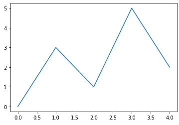
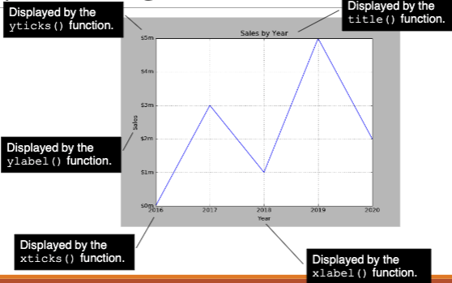
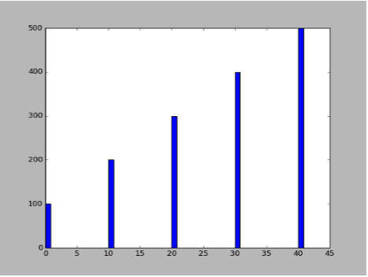
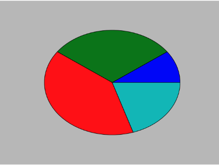

# Matplotlib

- The `matplotlib` package is a library for creating two-dimensional charts and graphs.
- It is not part of the standard Python library, so you will have to install it separately, after you have installed Python on your system.

## Setup

### Install
 - To install `matplotlib` on a Windows system, open a Command Prompt window and enter this command: 
   - `pip install matplotlib`
 - To install `matplotlib` on a Mac or Linux system, open a Terminal window and enter this command: 
   - `sudopip3 install matplotlib`

### Verify
- To verify the package was installed, start a python shell, then type `import matplotlib`
- If you don't see any error messages, you can assume the package was properly installed.

## Plotting Data with `matplotlib`
- The `matplotlib` package contains a module named `pyplot` that you will need to import.
- Use the following `import` statement to `import` the module and create an alias named `plt`
  - `import matplotlib.pyplot as plt`

### Plotting a Line Graph with the `plot` Function
- Use the `plot` function to create a line graph that connects a series of points with straight lines.
- The line graph has a horizontal `X-axis`, and a vertical `Y-axis`.
- Each point in the graph is located at a `(X,Y)` coordinate.

Example:
```python
# This program displays a simple line graph.
import matplotlib.pyplot as plt

def main():
    # Create lists with the X and Y coordinates of each data point.
    x_coords= [0, 1, 2, 3, 4]
    y_coords= [0, 3, 1, 5, 2]
    
    # Build the line graph.
    plt.plot(x_coords, y_coords)
    
    # Display the line graph.
    plt.show()
    # Call the main function.
    
main()
```


### Axis Bounds
You can change the lower and upper limits of the `X-axis` and `Y-axis` by calling the `xlim` and `ylim` functions. 
Example:
```python
# Causes the X-axis to begin at 1 and end at 100
plt.xlim(xmin=1, xmax=100)

# Causes the Y-axis to begin at 10 and end at 50
plt.ylim(ymin=10, ymax=50)
```

# Axis Ticks
- You can customize each tick mark's label with the `xticks` and `yticks` functions.
- These functions each take two lists as arguments. 
  1) The first argument is a list of tick mark locations
  2) The second argument is a list of labels to display at the specified locations. 
```python
# replaces the x-axis with years
plt.xticks([0, 1, 2, 3, 4],['2016', '2017', '2018', '2019', '2020'])

# replaces the y-axis with money
plt.yticks([0, 1, 2, 3, 4, 5],['$0m', '$1m', '$2m', '$3m', '$4m', '$5m'])
```

Example:
Plotting.ipynb
```python
# This program displays a simple line graph.
import matplotlib.pyplot as plt 

def main():
    # Create lists with the X,Y coordinates of each data point.
    x_coords= [0, 1, 2, 3, 4]
    y_coords= [0, 3, 1, 5, 2]
    # Build the line graph.
    plt.plot(x_coords, y_coords, marker='o')
    
    # Add a title.
    plt.title('Sales by Year')
    
    # Add labels to the axes.
    plt.xlabel('Year')
    plt.ylabel('Sales')
    
    # Customize the tick marks.
    plt.xticks([0, 1, 2, 3, 4], ['2016', '2017', '2018', '2019', '2020'])
    plt.yticks([0, 1, 2, 3, 4, 5], ['$0m', '$1m', '$2m', '$3m', '$4m', '$5m'])
    
    # Add a grid.
    plt.grid(True)
    
    # Display the line graph.
    plt.show()
    
# Call the main function.0
main()
```



## Plotting a Bar Chart
- Use the barfunction in the `matplotlib.py` plotmodule to create a bar chart.
- The function needs two lists: one with the `X` coordinates of each bar's left edge, and another with the heights of each bar, along the Y axis. 

```python
left_edges= [0, 10, 20, 30, 40]
heights = [100, 200, 300, 400, 500]

plt.bar(left_edges, heights)
plt.show()
```


### Bar Colors
- The `bar` function has a `color` parameter that you can use to change the colors of the bars. 
- The argument that you pass into this parameter is a tuple containing a series of color codes. 
  
|Color Code|Corresponding Color|
|----------|-------------------|
|`'b'`|Blue|
|`'g'`|Green|
|`'r'`|Red|
|`'c'`|Cyan|
|`'m'`|Magenta|
|`'y'`|Yellow|
|`'k'`|Black|
|`'w'`|White|

Example:
```python
# Example of how to pass a tuple of color codes as a keyword argument:

plt.bar(left_edges, heights, color=('r', 'g', 'b', 'w', 'k'))

"""
The first bar will be red.

The second bar will be green.

The third bar will be blue.

The fourth bar will be white.

The fifth bar will be black.
"""
```

### Additional Customizations
Similar to line graphs
- Use the `xlabel` and `ylabel` functions to add labels to the X and Y axes. 
- Use the `xticks` and `yticks` functions to display custom tick mark labels along the X and Y axes

## Plotting a Pie Chart
- You use the `pie` function in the `matplotlib.py` plot module to create a pie chart.
- When you call the `pie` function, you pass a list of values as an argument. 
  1) The **sum** of the values will be used as the value of the whole. 
  2) **Each element** in the list will become a slice in the pie chart. 
  3) The **size of a slice** represents that element's value as a percentage of the whole.

```python
values = [20, 60, 80, 40]
plt.pie(values)
plt.show()
```


### Labels
The `pie` function has a `labels` parameter that you can use to display labels for the slices in the pie chart. 
```python
"""
The argument that you pass into this parameter 
is a list containing the desired labels, as strings. 
"""
sales = [100, 400, 300, 600]
slice_labels = ['1st Qtr', '2nd Qtr', '3rd Qtr', '4th Qtr']
plt.pie(sales, labels=slice_labels)
plt.title('Sales by Quarter')plt.show()
```

### Colors
The `pie` function automatically changes the color of the slices, in the following order:
  
| 1 | 2 | 3 | 4 | 5 | 6 | 7 | 8 |
|---|---|---|---|---|---|---|---|
|blue|green|red|cyan|magenta|yellow|black|white|

- You can specify a different set of colors, however, by passing a tuple of color codes as an argument to the `pie` function's `colors` parameter: 
```python
"""
When this statement executes, the colors of the slices in the 
resulting pie chart will be red, green, blue, white, and black.
"""
plt.pie(values, colors=('r', 'g', 'b', 'w', 'k'))
```