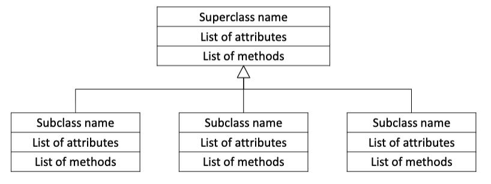

# Object Oriented Programming

### Types of Programming

**Procedural Programming**
1) Centered on procedures or actions that take place in a program
2) Functions with inputs and outputs
3) `Out1, out2 = foo(in1, in2)`
4) Lets think about
    1) What happens if `foo` needs more inputs/outputs in the future?
    2) How do I create different types of `foo` objects
    3) How do I hid (make invisible) some attributes of the objects?

**Object-Oriented Programming**
 1) Object –a software entity that contains attributesand methods 
    1) Represents an entity in the real world that can be distinctly identified
    2) Examples: a student, a desk, a circle, a button, a loan  
 2) Each **object** has a unique identity, state, and behaviors 
    1) Identity – name of the object (like a variable name) 
    2) State – defines the object 
       1) A set of **attributes** with their current values
    3) Behavior – defines what an object does 
       1) Defined by a set of **methods** (or functions)

**Benefits of OO Programming**
Solves problems associated with separating data and code
- Encapsulation – combining data and code into a single object
- Data hiding – ability of an object to hide attributes from external code
  - External code can only interact with an object’s methods
- Object reusability - objects are not stand-alone programs
  - Any program that needs an object’s services can use them


## Classes
Classes – code that specifies attributes and methods for a particular object type 
- Like blueprints for the object
- Classes are the design for the object

### Class Definition
Set of statements that define the methods and data attributes of a class

`self` parameter – required in every method! References the specific object that method should operate on
```python
class ClassName:
    # Initializer method
    # Automatically executed when an object of this class is created
    def__init__(self):
        # Initializes data attributes of the object just created
        self.attribute = value

    def method_name(self):
        statement(s)

    def method_name(self):
        statement(s)
```

### Creating Objects
Creating Object from a file `class.py`
```python 
import class # Lets Python “see” the .py with class definition

def main():
    # Calls __init__method to create an object of the class
    object_name = class.Class()

    # Accesses public attributes of an object
    print(object_name.attribute)

    # Calls method of an object
    var_name = object_name.method(arguments(s))

main()
```

### Hiding Data Attributes
Data hiding – ability of an object to hide attributes from external code
- External code should only interact with an object’s methods

Python syntax:
```python 
def __init__(self):
    # Double underscore makes attribute private (cannot be accessed outside of the class)
    self.__attribute = value
```

Example:
```Python
# Define class in circle.py
class Circle:
    def__init__(self):
        self.__radius= 1.0
        self.border= 2.0
        self.color= 'black'


# in main.py
import circle
def main():
    my_circ = circle.Circle()
    print(my_circ.border) # public
    print(my_circ.radius) # private, therefore fails
    print(my_circ.color)  # public

main()
```

### Accessors and Mutators (Getters and Setters)
If we hide the data attributes in an object, how does external code access them? 

**Accessors** – used to retrieve data attribute values from an object
```Python 
def get_attribute(self):
    return self.__attribute
```
**Mutators** – used to change data attribute values in an object
```python
def set_attribute(self, value):
    self.__attribute = value
```


### Using the `__str__() `Method
How do we use the `__str__()` method?
- When you refer onlyto the object, the `__str__()` method will be called
- A string will be returned
- Can print the string to see the attribute values!

```python
import class
def main():
    my_object = class.Class()
    print(my_object) # Implicitly calls __str__()from Class
main()
```

### Using Multiple Objects/Instances\
How do we create multiple objects using a class? 
- Each object has its own set of attributes and values
- Each object must be stored separately

```python 
import class
def main():
    # Each object has its own set of attributes
    object_name1 = class.Class()
    object_name2 = class.Class()

    print(object_name1)
    print(object_name2)

main()
```

### Passing Objects As Arguments
Can we pass an object as an argument to a function? 
- Yes! Objects are **passed by reference**
- Changes made to the object in the function change the actual object
- Similar to lists, dictionaries, and sets

## Generalization Versus Specialization
**Generalization versus specializatio**n
In reality, many objects are specialized versions of more general objects
 - Shapes have similar *characteristics*, like *color* and *border*
 - Specific shapes, like *circles* and *squares*, have *special characteristics* of their own

## Inheritance
**Inheritance** 
1) Allows a new class (*subclass*) to extend an existing class (*superclass*)
2) The new class inherits all members of the class it extends

**Superclass** - the general class (aka the parent)
1) Contains general/common attributes and methods

**Subclass** – the specialized class (aka the child)
1) Inherits attributes and methods from superclass
2) New attributes and methods may be written
3) Superclass methods may be redefined




```python
# in superslass.py
class Superclass:
    def __init__(self, params):
        self.__attribute = param
    def method_name(self):
        statement(s)
    def method_name(self):
        statement(s)

# in subclass.py
import superclass

class Subclass(superclass.Superclass): # Indicates inheritance
    def __init__(self, params):
        # Calls __init__method to  create attributes of superclass
        super().__init__(params)

        # Creates attribute(s) specific to subclass
        self.__attribute= value

    # Method(s) specific to subclass
    def method_name(self):
        statement(s)
    def method_name(self):
        statement(s)
```

## Iterators in Python
- Iterators are elegantly implemented in Python within repetition loops but hidden in plain sight.
- Iterator in Python is simply an object that can be iterated upon. An object which will return data, one element at a time.
- If we were to implement iterator, we must implement two special methods, `__iter__()` and `__next__()`, collectively called the iterator protocol.
- An object is called *iterable* if we can get an iterator from it. Most of built-in containers in Python like: list, tuple, string etc. are iterables.
- The `iter()` function (which in turn calls the `__iter__()` method) returns an iterator from them.
```python
#
mytuple = ("apple", "banana", "cherry")

# calls __iter__()
myit = iter(mytuple) 

print(next(myit))
print(next(myit))
print(next(myit))
```
Print-out
```
apple
banana
cherry
```

## Generators in Python
- Lot of overhead in building an iterator in Python
  - A class with `__iter__()` and `__next__()` method
  - Keep track of internal states
  - Raise `StopIteration` when there was no values to be returned etc.
- This is both lengthy and counter intuitive. Generator comes into rescue in such situations.
- Python generators are a simple way of creating iterators
- Simply speaking, a generator is a function that returns an object (iterator) which we can iterate over (one value at a time).

Example 1:
```python
# A simple generator function
def MyGen():
    n = 1
    print('This is printed first')
    # Generator function contains yield statements
    yield 1
    
    n += 2
    print('This is printed second')
    yield n

    n += 2
    print('This is printed at last')
    yield n

n = MyGen()
print(n)
print(next(n))
print(next(n))
print(next(n))
```
Print-out
```
<generator object MyGen at 0x0000023553CCA5C8>
This is printed first
1
This is printed second
3
This is printed at last
5
```

Example 2:
```python
def foo_with_yield():
    yield 1
    yield 2
    yield 3

x = foo_with_yield()
print(x)
print(next(x))
print(x)
print(next(x))
print(x)
print(next(x))
```
Print-out
```
<generator object foo_with_yield at 0x0000023553CCA1C8>
1
<generator object foo_with_yield at 0x0000023553CCA1C8>
2
<generator object foo_with_yield at 0x0000023553CCA1C8>
3
```